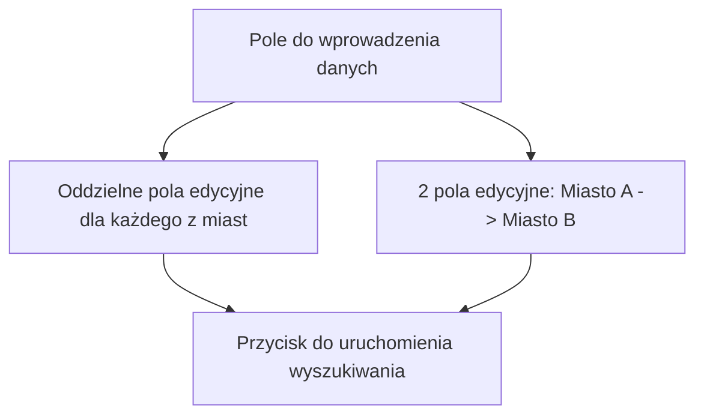
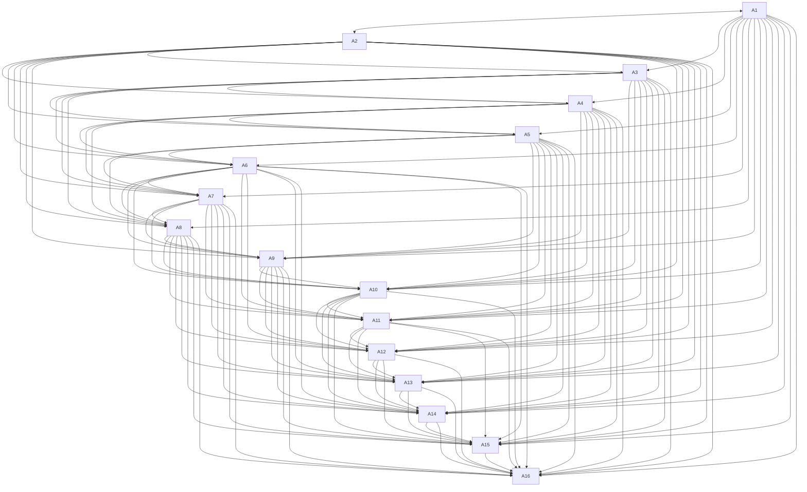

# CitiesTravelling

## Założenia projektu:
### Aplikacja będzie pokazywać najlepszą ścieżkę pomiędzy miastami przy jednoczesnym odwiedzaniu każdego z miast tylko raz.

## Funkcjonalności

## Wygląd

## Ścieżka miast

## Rozwiązania
